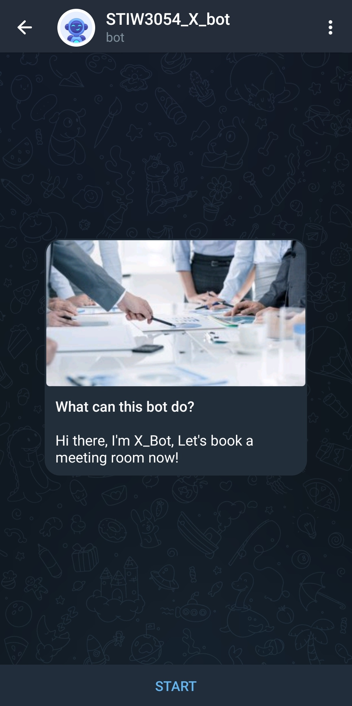
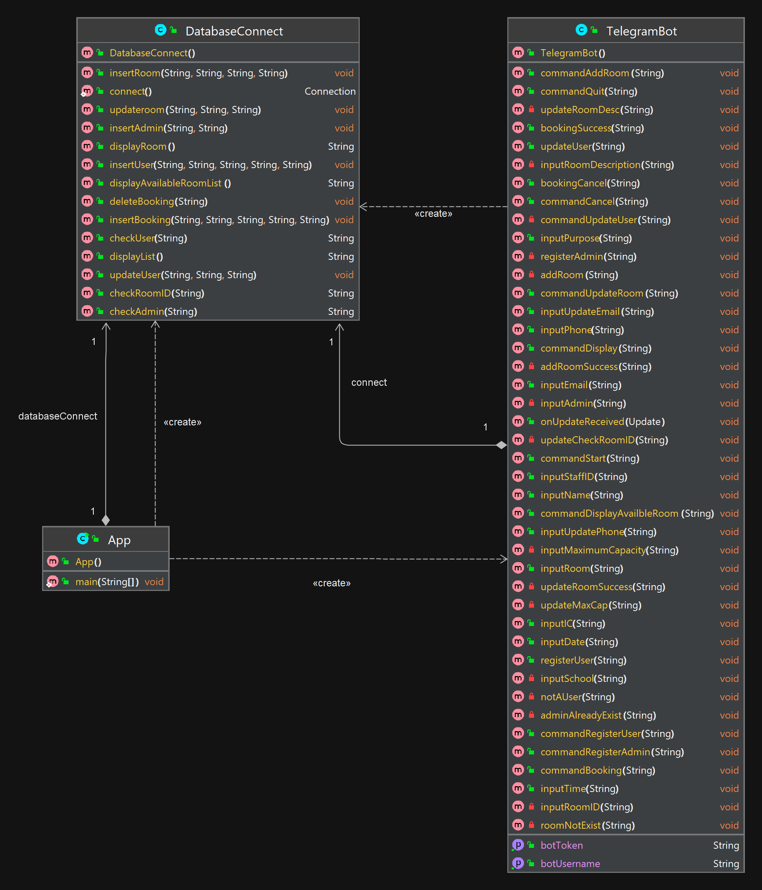
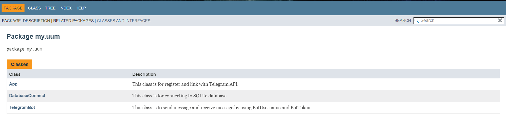

## Requirements for Group Project
[Read the instruction](https://github.com/STIW3054-A221/class-activity-soc/blob/main/GroupProject.md)

    
    
    
    
    
    
    
    
    
    
    
    
    
    
    
    
    
    
    
    
    
    
    
    
    
    
    
    
    

 

# 
STIW3054_X_BOT

    
    
    
    
    
    
    
    
    
    
    
    
    
    
    
    
    
    
    
    
    
    
    
    
    
    
    
    
    

 

## ➡️ Group Members 

 

## ➡️ Title of your application 
### STIW3054_X_Bot - https://t.me/STIW3054_X_bot  

## ➡️ Introduction

This group project is based on STIW3054_X_Bot, a Telegram bot for booking rooms in University Utara Malaysia. 
The bot's primary audience consists of school administrators and users. School administrators can add or update room details such as ID, description, room type, and maximum capacity. 
The bot will show a list of available rooms for booking to make the user's booking procedure easier. 
To book a room, a user must enter their identity card number, staff ID, name, phone number, email address, purpose for booking, booking date and time. 
Before booking confirmation, the user can additionally amend their personal information. 
Since we provided the room details in the bot, the user can book the room based on the number of guests. 
By providing the staff id used to book before, the user can delete the booking. 
The bot can also generate a list of all user details that booked a room.
 

## ➡️ Flow Diagram of the requirements
 

## ➡️ User manual for installing your application on Heroku Server

##  INTELLIJ

#### Step 1
Open your pom.xml file from your java bot project, after dependencies tag. Specify the exact path of your Main class.

    
      <plugin>
        <groupId>org.codehaus.mojo</groupId>
        <artifactId>appassembler-maven-plugin</artifactId>
        <version>1.1.1</version>
        <configuration>
          <assembleDirectory>target</assembleDirectory>
          <programs>
            <program>
              <mainClass>my.uum.App</mainClass>
              <name>workerBot</name>
            </program>
          </programs>
        </configuration>
        <executions>
          <execution>
            <phase>package</phase>
            <goals>
              <goal>assemble</goal>
            </goals>
          </execution>
        </executions>
      </plugin>

  
#### Step 2
In the main project path create a file called:

“Procfile” inside it.

#### Step 3
Write down the code below in the Procfile.

    worker: sh target/bin/workerBot 
    
    
##  HEROKU

#### Step 1
Login to the account

#### Step 2
Click New dropdown on the top right 

#### Step 3
Select Create New App
    
    - Enter App name 
    - Choose Region as United States 
    - Click create app button 

#### Step 4
Choose Deployment method in Deploy, select GitHub option.

    - Login to Github Account by entering the credential
    - Authorize it 
    
#### Step 5
Enable the automatic and manual deploy function. 

## ➡️ User manual/guideline for testing the system

### Telegram Installation
### You can download Telegram for your respective Mobile devices & Web browsers

#### 📱 Telegram for Android

#### 📲 Telegram for iPhone and iPad

#### 💻 Telegram for Windows/Mac/Linux

### How to find our STIW3054_X_Bot?

https://user-images.githubusercontent.com/93847761/213619599-55e7d381-de34-48db-9878-fde43522c916.mp4

##  👧🏻 USER 

### 🔆 /start (Main Menu)
#### Step 1
The user needs to click or type '/start' to start the bot.
#### Step 2
The bot will display the main menu with available commands for using the bot.

### 🔆 /registeruser (User Registration)
#### Step 1
The user must register an user account before proceeding to other functions.
#### Step 2
The user needs to type or click on '/registeruser' to register a user account.
#### Step 3
The bot will ask user for confirmation if they are sure about registering or not. 
#### Step 4
The user needs to reply 1 for “Yes” and 2 for “No”.

    - If the user enters 2, the bot will stop the registering process.
    - If the user enters 1, the bot will ask for user’s “name”, “IC number”, “staff ID”, “phone number” and “email address” one after another. The user needs to reply accordingly by following the given format.
    
#### Step 5
The bot will display the registered user details. Now the user can proceed with other functions.
#### Step 6
The user can stop the process by replying 0 anytime during the process.

### 🔆 /updateuser (Update user information)

#### Step 1
The user needs to type or click on '/updateuser' to update the registered user details. The user can only update “email address” and “phone number”.
#### Step 2
The bot will ask for confirmation if the user really wants to update user details or not.
#### Step 3
The user needs to reply 7 for “Yes” and 8 for “No”.

    - If the user replies 8, the bot will stop the updating process.
    - If the user replies 7, the bot will ask for the updated “email address” and “phone number”. The user needs to reply accordingly by following the format.
    
#### Step 4
The bot will display the updated user details.
#### Step 5
The user can stop the process by replying 0 anytime during the process.

### 🔆 /booking (Booking for meeting room)

#### Step 1
The user needs to type or click on '/booking' to book a meeting room.
#### Step 2
The bot will ask for confirmation if the user really wants to continue to book room or not.
#### Step 3
The user needs to reply ‘Y’ for “Yes” and ‘N’ for “No”.

    - If the user replies ‘N’, the bot will stop the booking process.
    - If the user replies ‘Y’, the bot will continue the booking.
    
#### Step 4
The bot will display a list of available meeting rooms and the user needs to choose the preferred room by replying using the given code for the rooms.
#### Step 5
Then the bot will ask user for “purpose of booking room”, “preferred date” and “preferred time”. The user needs to reply accordingly by following the format.
#### Step 6
The bot will display the updated user details.
#### Step 7
The user can stop the process by replying 0 anytime during the process.

### 🔆 /bookinglist (View users' booking list)

#### Step 1
The user needs to type or click on '/ bookinglist' to view the list of rooms users booked.
#### Step 2
The bot will display the list of booked rooms.

### 🔆 /cancel (Cancel booking flow)

#### Step 1
The user needs to type or click on '/cancel' to cancel their room booking.
#### Step 2
The bot will ask for user’s staff ID to cancel the room booking.
#### Step 3
The user needs to enter their staff ID.
#### Step 4
The bot will display a message for successfully cancelling the room booking.

### 🔆 /roomlist (View available meeting room list)

#### Step 1
The user needs to type or click on '/roomlist' to view the available rooms.
#### Step 2
The bot will display the list of available rooms.

##  👨🏻‍💻 ADMIN

### 🔆/registeradmin (School admin registration)

#### Step 1
The user must register as user before registering as school admin. One school only can have one school admin.
#### Step 2
The user needs to type or click on '/registeradmin' to register an admin account.
#### Step 3
The bot will ask user for confirmation if they are sure about registering or not. 
#### Step 4
The user needs to reply 3 for “Yes” and 4 for “No”.
#### Step 5
If the user enters 4, the bot will stop the registering process.
#### Step 6
If the user enters 3, the bot will ask for user’s registered staff ID.
#### Step 7
The user needs to enter their staff ID.
#### Step 8
If the staff ID is invalid, the bot will ask the user to create a user account first, then continue. Otherwise, it will continue the registration process.
#### Step 9
The bot will display a list of schools and the user needs to choose the preferred school they want to be the admin by replying using the given code for the chosen school.

    - If the chosen school already have an admin, the bot will display a message to stating admin already exists for that school.
    - If the chosen school doesn’t have any admin yet, the bot will complete the admin register process.
    
#### Step 10
The bot will display the registered admin details. Now the user can proceed with other admin functions.
#### Step 11
The user can stop the process by replying 0 anytime during the process.

### 🔆/addroom (Add meeting room)

#### Step 1
The user needs to type or click on '/addroom' to add a new meeting room detail.
#### Step 2
The bot will ask user for confirmation if they want to proceed with adding new room or not. 
#### Step 3
The user needs to reply 5 for “Yes” and 6 for “No”.

    - If the user enters 6, the bot will stop the registering process.
    - If the user enters 5, the bot will ask for user’s registered school.
    
#### Step 4
The user needs to enter their respective school.
#### Step 5
Then the bot will ask for “meeting room ID”, “room description” and “maximum capacity of the room” one after another. The user needs to reply accordingly by following the given format.
#### Step 6
The bot will display the newly added meeting room details.
#### Step 7
The user can stop the process by replying 0 anytime during the process.

### 🔆/updateroom (Update meeting room information)

#### Step 1
The user needs to type or click on '/updateroom' to update the registered meeting room details.
#### Step 2
The bot will ask for confirmation if the user really wants to update room details or not.
#### Step 3
The user needs to reply 9 for “Yes” and 10 for “No”.
    
    - If the user replies 10, the bot will stop the updating process.
    - If the user replies 9, the bot will ask for meeting room ID.
    
#### Step 4
The user needs to enter a valid meeting room number.
#### Step 5
The bot will ask the user for updated “room description” and “maximum capacity”. The user needs to reply accordingly by following the format.
#### Step 6
The bot will display the updated user details.
#### Step 7
The user can stop the process by replying 0 anytime during the process. 

## ➡️ Result/Output (Screenshot of the output)
First entering X_Bot: 
 

Command '/start' (main menu): 
 

Command '/registeruser' (user registration): 
Note: User must register first before proceed to other functions. 
 

Reply '1' (proceed to user registration): 
 

Reply '2' (quit from user registration): 
 

Reply '0' during user registration section (quit from user registration): 
 

Normal flow for user registration: 
 
 

Command '/roomlist' (view available meeting room list): 
 

Command '/booking' (booking for meeting room): 
 

Reply 'Y' or 'y' (proceed to booking section): 
 
 

Reply 'N' or 'n' (quit from booking section): 
 
 

Reply '0' during booking section (quit from booking section): 
 

Normal flow for booking section: 
 
 
 

Command '/bookinglist' (view users' booking list): 
 

Command '/updateuser' (update user information): 
 

Reply '7' (proceed to update user information section): 
 

Reply '8' (quit from update user information section): 
 

Reply '0' during update user information section (quit from update user information section): 
 

Normal flow for update user information section: 
 

Before and after update user information in the booking list: 
 
 

Command '/cancel' (cancel booking flow): 
 

Latest booking list after user cancel booking: 
 

Command '/registeradmin' (school admin registration): 
Note: School admin must be the user first, one school only can have one school admin 
 

Reply '3' (proceed to school admin registration): 
 

Reply '4' (quit from school admin registration): 
 

Reply '0' during school admin registration section (quit from school admin registration): 
 

Register school admin without register user: 
 

Admin already exist for the school: 
 

Normal flow for school admin registration: 
 
 

Command '/addroom' (add meeting room): 
Note: Only school admin can add meeting room 
 

Reply '5' (proceed to add meeting room section): 
 

Reply '6' (quit from add meeting room section): 
 

Reply '0' during add meeting room section (quit from add meeting room section): 
 

Normal flow for add meeting room section: 
 
 
 

After add room in the room list: 
 

Command '/updateroom' (update meeting room information): 
Note: Only school admin can update meeting room information 
 

Reply '9' (proceed to update meeting room section): 
 

Reply '10' (quit from update meeting room section): 
 

Reply '0' during update meeting room section (quit from update meeting room section): 
 

Room does not exist: 
 

Normal flow for update meeting room section: 
 
 

Before and after update meeting room information in the room list: 
 
 

## ➡️ Use Case Diagram
 

## ➡️ UML Class Diagram
 

## ➡️ Database Design
 

## ➡️ Youtube Presentation

&nbsp;&nbsp;&nbsp;▶️ &nbsp; https://youtu.be/toJaUa8KSKM
 

## ➡️ References (Not less than 20)

Amit Thinks. (2022, June 7). How to install SQLite on Windows 10 | 2022 | Amit Thinks. YouTube. https://www.youtube.com/watch?v=L3FwRRx6bqo

Azamat Ordabekov. (2021, November 11). How to create Telegram Bot in Java. YouTube. https://www.youtube.com/watch?v=XjOnp8TVNSQ

Bot API Library Examples. (n.d.). https://core.telegram.org/bots/samples

Code Java. (2020, October 25). Java Connect to SQLite Database Example. YouTube. https://www.youtube.com/watch?v=293M9-QRZ0c

Fraser. (2019, December 24). How To Install The Heroku CLI in Windows 10. YouTube. https://www.youtube.com/watch?v=fpEgZi3_RI4

fw_error_www. (n.d.). https://community.oracle.com/tech/developers/discussion/1420689/how-to-verify-if-user-already-exists-in-mysql-database-using-jsp

GAURAV SUNIL AGARWAL 14BCE0127. (2017, November 8). Heroku Deployment using Github. YouTube. https://www.youtube.com/watch?v=3tK9qIdoJ6I

GeeksforGeeks. (2021, December 7). Daemon Thread in Java. https://www.geeksforgeeks.org/daemon-thread-java/

GeeksforGeeks. (2022, July 11). Introduction and Installation of Heroku CLI on Windows machine. https://www.geeksforgeeks.org/introduction-and-installation-of-heroku-cli-on-windows-machine/

GeeksforGeeks. (2023, January 17). HashMap in Java with Examples. https://www.geeksforgeeks.org/java-util-hashmap-in-java-with-examples/

GitHub Integration (Heroku GitHub Deploys) | Heroku Dev Center. (n.d.). https://devcenter.heroku.com/articles/github-integration

Heroku not recognized as an internal or external command (Windows). (2017, February 11). Stack Overflow. https://stackoverflow.com/questions/42170691/heroku-not-recognized-as-an-internal-or-external-command-windows

Java HashMap. (n.d.). https://www.w3schools.com/java/java_hashmap.asp

Just a moment. . . (n.d.). https://www.baeldung.com/java-daemon-thread

RedSysTech. (2021, August 7). # 111 Internal Working of HashMap in Java | How HashMap works internally in java | Java | RedSysTech. 
YouTube. https://www.youtube.com/watch?v=HArvh9AZ1IE

Shift Academy. (2022, May 5). Java telegram bot PRO! YouTube. https://www.youtube.com/watch?v=qdrCGjskHKQ

SQLite INNER JOIN with Examples. (2022, April 3). SQLite Tutorial. https://www.sqlitetutorial.net/sqlite-inner-join/

SQLite Java: Deleting Data. (2022, August 28). SQLite Tutorial. https://www.sqlitetutorial.net/sqlite-java/delete/

SQLite Java: Inserting Data. (2022, August 28). SQLite Tutorial. https://www.sqlitetutorial.net/sqlite-java/insert/

SQLite Java: Select Data. (2022, August 28). SQLite Tutorial. https://www.sqlitetutorial.net/sqlite-java/select/

SQLite Java: Update Data. (2022, August 28). SQLite Tutorial. https://www.sqlitetutorial.net/sqlite-java/update/

The Heroku CLI | Heroku Dev Center. (n.d.). https://devcenter.heroku.com/articles/heroku-cli

Zaur Hasanov. (2018, February 10). How to create Telegram Bot in Java [ Tutorial ]. YouTube. https://www.youtube.com/watch?v=xv-FYOizUSY  

## ➡️ JavaDoc
<a href='https://fooroonyi.github.io/Javadoc_X_Bot/my/uum/package-summary.html'>Javadoc for Group X_Bot</a>

